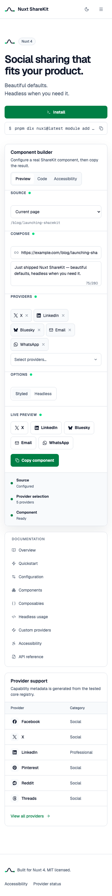

# Nuxt ShareKit

[](https://github.com/Ray0907/nuxt-sharekit/actions/workflows/ci.yml)
[](https://nuxt.com)
[](https://www.w3.org/TR/WCAG22/)
[](LICENSE)

Social sharing that fits your product. Beautiful defaults, headless when you need it.

Nuxt ShareKit is an accessible, headless-friendly social sharing module built for Nuxt 4.
It combines a framework-agnostic TypeScript intent engine with Vue components, a composable,
browser fallbacks, native sharing, copy link, and SSR-safe QR codes.

> **Project status:** source-ready preview. The packages have not been published to npm yet.

## Snapshot

<picture>
	<source
		media="(prefers-color-scheme: dark)"
		srcset="docs/design/home-desktop-dark.png"
	>
	<source
		media="(prefers-color-scheme: light)"
		srcset="docs/design/home-desktop-light.png"
	>
	
</picture>

The snapshot is captured from the real Nuxt 4 documentation app and component builder. GitHub
automatically selects the matching light or dark version.

<details>
<summary>View mobile snapshot</summary>
<br>

</details>

## Contents

- [Snapshot](#snapshot)
- [Why ShareKit](#why-sharekit)
- [Requirements](#requirements)
- [Installation](#installation)
- [Quick start](#quick-start)
- [Share payload](#share-payload)
- [Components](#components)
- [Composable](#composable)
- [Providers and presets](#providers-and-presets)
- [Custom providers](#custom-providers)
- [Headless usage](#headless-usage)
- [Theming](#theming)
- [Results and browser behavior](#results-and-browser-behavior)
- [Accessibility](#accessibility)
- [Architecture](#architecture)
- [Development](#development)
- [Contributing and security](#contributing-and-security)

## Why ShareKit

- **21 built-in providers:** social, professional, messaging, communication, and read-later
  destinations with typed capability metadata.
- **Product-ready defaults:** calm semantic styling, light and dark themes, responsive layouts,
  and no Tailwind requirement for consumers.
- **Headless when needed:** opt out globally or per component, then compose with your own design
  system through props, slots, and custom provider registries.
- **Accessible by contract:** semantic controls, keyboard navigation, visible focus, live result
  announcements, 44px targets, and reduced-motion support.
- **Browser-aware actions:** provider intents, native Web Share, clipboard handling, blocked popup
  detection, and explicit result states.
- **Nuxt-native integration:** automatic component registration, automatic `useShare` import,
  Nuxt 4 SSR support, and configurable component prefixes.
- **Portable core:** `@nuxt-sharekit/core` has no Vue or Nuxt dependency and can power future
  framework adapters.

Nuxt UI and Nuxt Content are intentionally not dependencies. `ShareMenu` uses Reka UI directly
for accessible menu behavior. The documentation workbench uses Tailwind CSS v4, while the runtime
package ships a small semantic stylesheet.

## Requirements

| Dependency | Version |
| --- | --- |
| Node.js | `>= 22` |
| Nuxt | `^4.0.0` |
| Vue | `^3.5.0` |
| Package manager | pnpm recommended |

Nuxt 3 is not supported. A Next.js adapter is not included; the framework-agnostic core is the
extension point for one.

## Installation

Once the package is published to npm, install it with the Nuxt CLI:

```bash
pnpm dlx nuxi@latest module add nuxt-sharekit
```

Or install and configure it manually:

```bash
pnpm add nuxt-sharekit
```

```ts
// nuxt.config.ts
export default defineNuxtConfig({
	modules: ['nuxt-sharekit'],
	shareKit: {
		componentPrefix: 'Share',
		styled: true
	}
})
```

### Module options

| Option | Type | Default | Description |
| --- | --- | --- | --- |
| `componentPrefix` | `string` | `'Share'` | Prefix for all registered components. |
| `styled` | `boolean` | `true` | Adds the packaged semantic stylesheet. |

Changing the prefix to `Social` registers `SocialButton`, `SocialGroup`, `SocialMenu`, and
`SocialQr`. Set `styled: false` when your application will provide every visual style.

### Work with the repository today

```bash
git clone https://github.com/Ray0907/nuxt-sharekit.git
cd nuxt-sharekit
corepack enable
pnpm install
pnpm dev
```

## Quick start

Components and `useShare` are auto-imported by the module.

```vue
<script setup lang="ts">
const payload_share = {
	url: 'https://example.com/launch',
	title: 'Launch notes',
	text: 'A calmer sharing toolkit',
	hashtags: ['nuxt', 'vue']
}

function handleResult(result_share: unknown) {
	console.log(result_share)
}
</script>

<template>
	<ShareGroup
		:payload="payload_share"
		@result="handleResult"
	/>
</template>
```

The default group uses the `recommended` preset: X, LinkedIn, Bluesky, WhatsApp, and Email. It
also includes copy-link and native-share actions.

## Share payload

Every action starts with a `SharePayload`:

```ts
interface SharePayload {
	url: string
	title?: string
	text?: string
	media?: string
	hashtags?: readonly string[]
	via?: string
	instance?: string
}
```

| Field | Description |
| --- | --- |
| `url` | Required HTTP or HTTPS URL to share. Relative URLs need `baseUrl` in `useShare`. |
| `title` | Page or content title used by providers that accept one. |
| `text` | Share copy, description, or message body. |
| `media` | Absolute or base-resolvable HTTP/HTTPS image URL. |
| `hashtags` | Tags with or without `#`; values are trimmed and de-duplicated. |
| `via` | Attribution handle with or without `@`. |
| `instance` | Mastodon instance URL, such as `https://mastodon.social`. |

Payload normalization rejects non-HTTP protocols for web and media URLs. Provider parameters are
encoded with `URLSearchParams` rather than string concatenation.

## Components

### `ShareButton`

Executes one provider intent.

```vue
<ShareButton
	provider="linkedin"
	:payload="payload_share"
	@result="handleResult"
/>
```

| Prop | Type | Default | Description |
| --- | --- | --- | --- |
| `provider` | `string` | required | Built-in or custom provider id. |
| `payload` | `SharePayload` | required | Content to share. |
| `providerDefinition` | `ShareProvider` | — | Custom provider available to this button. |
| `label` | `string` | provider label | Accessible button label override. |
| `disabled` | `boolean` | `false` | Disables the control. |
| `unstyled` | `boolean` | `false` | Removes packaged component classes. |

Slots: `icon` receives `{ provider }`; default content receives `{ provider, pending }`.

### `ShareGroup`

Renders provider buttons plus optional copy and native-share actions.

```vue
<ShareGroup
	:payload="payload_share"
	:providers="['facebook', 'x', 'linkedin', 'email']"
	label="Share release notes"
	:show-native="true"
	:show-copy="true"
/>
```

| Prop | Type | Default | Description |
| --- | --- | --- | --- |
| `payload` | `SharePayload` | required | Content to share. |
| `providers` | `readonly string[]` | `recommended` | Provider ids to render. |
| `label` | `string` | `'Share this page'` | Accessible group label. |
| `showCopy` | `boolean` | `true` | Displays the copy-link action. |
| `showNative` | `boolean` | `true` | Displays the Web Share action. |
| `unstyled` | `boolean` | `false` | Removes packaged component classes. |

The `provider` slot receives `{ provider, payload }`. Every action emits `result`.

### `ShareMenu`

Uses Reka UI's dropdown primitives for keyboard navigation, focus management, and portal
positioning.

```vue
<ShareMenu
	:payload="payload_share"
	:providers="['x', 'bluesky', 'telegram', 'email']"
/>
```

| Prop | Type | Default | Description |
| --- | --- | --- | --- |
| `payload` | `SharePayload` | required | Content to share. |
| `providers` | `readonly string[]` | `recommended` | Provider items in the menu. |
| `label` | `string` | `'Open share menu'` | Accessible trigger label. |
| `unstyled` | `boolean` | `false` | Removes packaged component classes. |

Slots: `trigger` replaces the trigger content; `item` receives `{ provider }`.

### `ShareQr`

Renders an SSR-safe SVG QR code without `v-html` or a browser-only canvas.

```vue
<ShareQr
	:payload="payload_share"
	:size="192"
	label="Scan to open the launch notes"
/>
```

| Prop | Type | Default | Description |
| --- | --- | --- | --- |
| `payload` | `SharePayload` | required | Its normalized URL is encoded. |
| `size` | `number` | `192` | Rendered SVG width and height in pixels. |
| `label` | `string` | generated | Accessible image label. |
| `unstyled` | `boolean` | `false` | Removes the figure class. |

## Composable

`useShare` accepts a value, ref, computed ref, or getter so payload changes stay reactive.

```ts
const share = useShare(
	() => payload_share,
	{
		baseUrl: () => 'https://example.com',
		providers: [provider_custom]
	}
)

await share.execute('bluesky')
await share.copy()
await share.native()

console.log(share.status.value)
console.log(share.result.value)
console.log(share.message.value)

share.reset()
```

| Member | Description |
| --- | --- |
| `status` | `idle`, `pending`, or the latest action status. |
| `result` | Latest structured `ShareActionResult`. |
| `message` | User-facing status message suitable for a live region. |
| `getProvider(id)` | Resolves a built-in or composable-local custom provider. |
| `execute(id)` | Opens or navigates to a provider share intent. |
| `copy()` | Copies the normalized URL with the Clipboard API. |
| `native()` | Calls the Web Share API when available. |
| `reset()` | Returns status to `idle` and clears the result. |

## Providers and presets

ShareKit includes these providers:

| Provider id | Category | Accepted fields | Preset | Status |
| --- | --- | --- | --- | --- |
| `facebook` | Social | URL | all | Active |
| `x` | Social | URL, text, hashtags, via | recommended | Active |
| `linkedin` | Professional | URL | recommended | Active |
| `pinterest` | Social | URL, text, media | all | Active |
| `reddit` | Social | URL, title | all | Active |
| `threads` | Social | URL, text | all | Active |
| `bluesky` | Social | URL, text | recommended | Active |
| `mastodon` | Social | URL, text, instance | all | Setup required |
| `tumblr` | Social | URL, title, text | all | Active |
| `hackernews` | Social | URL, title | all | Active |
| `whatsapp` | Messaging | URL, text | recommended, messaging | Active |
| `telegram` | Messaging | URL, text | messaging | Active |
| `line` | Messaging | URL | messaging | Active |
| `email` | Communication | URL, title, text | recommended, messaging | Active |
| `sms` | Communication | URL, text | messaging | Active |
| `weibo` | Social | URL, title, media | all | Active |
| `qzone` | Social | URL, title, text, media | all | Active |
| `vk` | Social | URL, title, text, media | all | Active |
| `xing` | Professional | URL | all | Active |
| `instapaper` | Read later | URL, title, text | all | Active |
| `raindrop` | Read later | URL, title | all | Active |

Available presets:

```ts
import {
	getSharePreset,
	sharePresets
} from '@nuxt-sharekit/core'

getSharePreset('recommended')
getSharePreset('messaging')
getSharePreset('all')
```

Copy link, native Web Share, and QR are actions, not providers.

### Mastodon

Mastodon needs the user's instance because there is no single global compose endpoint:

```vue
<ShareButton
	provider="mastodon"
	:payload="{
		url: 'https://example.com/post',
		text: 'Read this post',
		instance: 'https://mastodon.social'
	}"
/>
```

Provider endpoints are external contracts and can change. Each provider exposes `verifiedAt`
metadata so audits can distinguish checked endpoints from assumptions.

## Custom providers

Custom providers are validated and isolated in an explicit registry.

```ts
import {
	createShareRegistry,
	defineShareProvider
} from '@nuxt-sharekit/core'

const provider_acme = defineShareProvider({
	id: 'acme',
	label: 'Acme Social',
	category: 'social',
	icon: 'lucide:send',
	fields: ['url', 'text'],
	buildUrl: payload => {
		const params_share = new URLSearchParams({
			url: payload.url,
			text: payload.text ?? ''
		})
		return `https://share.acme.test/?${params_share}`
	}
})

const registry_share = createShareRegistry([provider_acme])
const intent_share = registry_share.createIntent('acme', payload_share)
```

Custom ids must use lowercase letters, numbers, and hyphens. Duplicate ids, unsafe generated
protocols, missing labels, and missing icon metadata are rejected.

Use a custom provider directly in the Nuxt runtime:

```vue
<ShareButton
	provider="acme"
	:provider-definition="provider_acme"
	:payload="payload_share"
/>
```

## Headless usage

Disable all runtime styles in `nuxt.config.ts`, or use `unstyled` on one component.

```vue
<ShareGroup
	:payload="payload_share"
	:providers="['x', 'linkedin', 'email']"
	unstyled
>
	<template #provider="{ provider, payload }">
		<ShareButton
			:provider="provider"
			:payload="payload"
			unstyled
		>
			<template #default="{ provider: definition, pending }">
				<span>{{ pending ? 'Opening…' : definition.label }}</span>
			</template>
		</ShareButton>
	</template>
</ShareGroup>
```

`unstyled` removes ShareKit's visual classes, not semantic HTML, disabled state, accessible names,
or result announcements. When replacing styles, keep those behaviors intact.

## Theming

Override semantic CSS variables at any scope:

```css
:root {
	--share-bg: white;
	--share-bg-muted: oklch(0.98 0.01 155);
	--share-bg-elevated: white;
	--share-text: oklch(0.21 0.04 266);
	--share-text-muted: oklch(0.45 0.04 257);
	--share-border: oklch(0.9 0.01 258);
	--share-primary: oklch(0.52 0.13 154);
	--share-primary-hover: oklch(0.44 0.11 154);
	--share-accent: oklch(0.52 0.13 154);
	--share-focus: oklch(0.36 0.08 205);
	--share-radius-control: 0.5rem;
	--share-radius-panel: 0.75rem;
	--share-shadow-menu: 0 1rem 2.5rem oklch(0.21 0.04 266 / 12%);
}
```

ShareKit reads dark tokens under a `.dark` ancestor. You can replace those values or map the
variables to your own design system. Consumer applications do not need Tailwind CSS.

## Results and browser behavior

Every action returns and emits a structured result instead of hiding browser limitations:

```ts
type ShareActionStatus =
	| 'copied'
	| 'shared'
	| 'opened'
	| 'cancelled'
	| 'blocked'
	| 'unsupported'
	| 'failed'

interface ShareActionResult {
	method: 'copy' | 'native' | 'provider'
	status: ShareActionStatus
	providerId?: string
	error?: unknown
}
```

- Provider intents use a `640 × 560` popup where appropriate.
- Email and SMS navigate in the same tab through their native protocols.
- A blocked popup returns `blocked`, allowing the UI to offer copy link instead.
- Clipboard and Web Share actions return `unsupported` when the browser API is unavailable.
- Cancelling native share returns `cancelled`; other browser errors return `failed`.
- Browser APIs are accessed only during user actions, keeping component setup SSR-safe.

## Accessibility

The runtime targets WCAG 2.2 AA and includes:

- Native buttons and a labelled group rather than clickable generic elements.
- Reka UI menu keyboard navigation, focus management, and portal behavior.
- Visible `:focus-visible` outlines that do not rely on provider colors.
- Minimum 44px control and menu-item targets.
- `aria-busy`, disabled states, and polite live-region result announcements.
- Generated accessible names with explicit label overrides.
- A reduced-motion mode that removes transitions, press transforms, and menu animation.
- An accessible QR SVG with a text alternative.

Accessibility depends on the final application. If you use headless mode or replace slots, test
names, focus order, contrast, target size, reduced motion, and status announcements again.

## Architecture

```text
packages/core   Framework-agnostic provider, validation, registry, and action engine
packages/nuxt   Nuxt 4 module, Vue components, composable, and semantic runtime CSS
playground      Nuxt 4 SSR integration fixture
docs-app        Tailwind CSS v4 + Reka UI documentation workbench
docs            Product, design, implementation, and visual reference material
```

The separation keeps provider rules independent from UI rendering. Nuxt is the supported adapter;
other adapters can reuse `@nuxt-sharekit/core` without importing Vue.

Product decisions live in [PRODUCT.md](PRODUCT.md), visual rules in [DESIGN.md](DESIGN.md), and
the approved reference mock is in
[docs/design/nuxt-sharekit-homepage-mock.png](docs/design/nuxt-sharekit-homepage-mock.png).

## Development

```bash
corepack enable
pnpm install

# Documentation workbench
pnpm dev

# Nuxt module playground
pnpm dev:playground

# Verification
pnpm lint
pnpm test
pnpm typecheck
pnpm build
```

The workspace uses Node.js 22, pnpm 10, TypeScript, Vitest, ESLint, and Nuxt's module builder.
CI runs install, lint, tests, typechecks, and production builds on pushes to `main` and pull
requests.

### Test coverage

The current suite covers:

- Payload normalization and URL safety.
- Built-in provider metadata and encoded intents.
- Recommended and messaging presets.
- Custom registry validation and duplicate ids.
- Copy, native share, popup, blocked, unsupported, and cancelled results.
- Module registration, options, component behavior, and Nuxt 4 SSR integration.
- Documentation homepage SSR output.

## Contributing and security

Read [CONTRIBUTING.md](CONTRIBUTING.md) before opening a change. For security issues, follow the
private reporting process in [SECURITY.md](SECURITY.md) instead of creating a public issue.

Changes are tracked in [CHANGELOG.md](CHANGELOG.md).

## License

[MIT](LICENSE)
