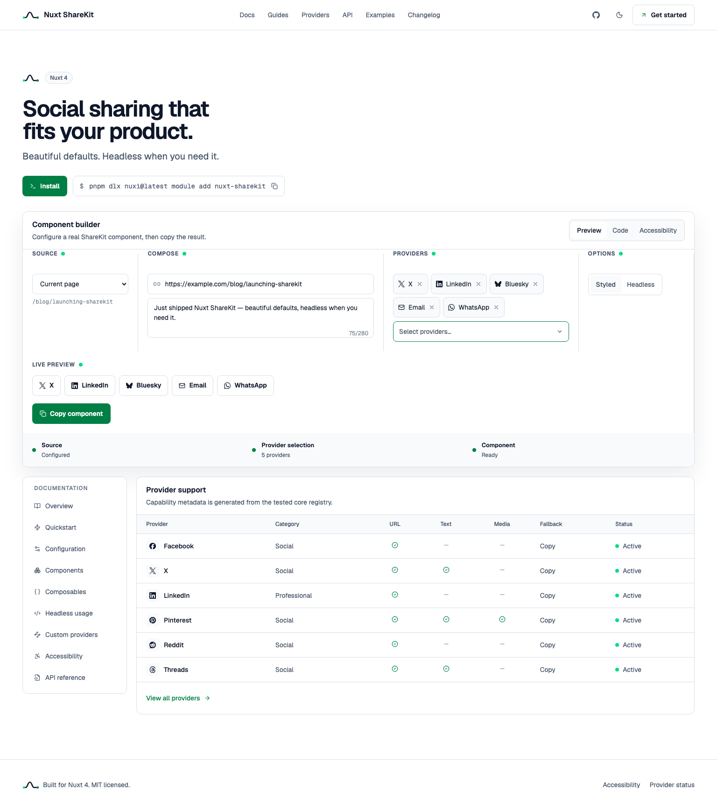

# Nuxt ShareKit

Social sharing that fits your product. Beautiful defaults, headless when you need it.



Nuxt ShareKit is a Nuxt 4-only sharing module with a framework-agnostic TypeScript core. It
ships accessible Vue components, composables, custom provider registries, browser fallbacks,
native share, copy link, and SSR-safe QR codes.

## Why ShareKit

- 22 built-in providers with typed capability and endpoint metadata.
- Styled defaults with semantic CSS variables and no Tailwind requirement for consumers.
- Headless components, slots, custom component prefixes, and isolated custom registries.
- Native share, copy link, pop-up handling, and explicit result states.
- WCAG 2.2 AA target: keyboard, accessible names, 44px targets, live regions, and reduced motion.
- Nuxt UI and Nuxt Content are not dependencies. `ShareMenu` uses Reka UI directly.
- Pure `@nuxt-sharekit/core` package for non-Nuxt consumers and future adapters.

## Install

```bash
pnpm dlx nuxi@latest module add nuxt-sharekit
```

Nuxt ShareKit supports Nuxt 4. It does not include a Nuxt 3 compatibility layer.

## Quickstart

```vue
<script setup lang="ts">
const payload_share = {
	url: 'https://example.com/launch',
	title: 'Launch notes',
	text: 'A calmer sharing toolkit'
}
</script>

<template>
	<ShareGroup :payload="payload_share" />
</template>
```

The module registers `ShareButton`, `ShareGroup`, `ShareMenu`, `ShareQr`, and auto-imports
`useShare`.

## Module options

```ts
export default defineNuxtConfig({
	modules: ['nuxt-sharekit'],
	shareKit: {
		componentPrefix: 'Share',
		styled: true
	}
})
```

Set `styled: false` to skip the package stylesheet, or pass `unstyled` to an individual
component.

## Headless usage

```vue
<ShareGroup
	:payload="payload_share"
	:providers="['x', 'linkedin', 'email']"
	unstyled
>
	<template #provider="{ provider, payload }">
		<ShareButton
			:provider="provider"
			:payload="payload"
			unstyled
		/>
	</template>
</ShareGroup>
```

When replacing the default styles, preserve the accessible name, visible focus, 44px target,
and result announcement.

## Composable

```ts
const share = useShare(() => payload_share)

await share.execute('bluesky')
await share.copy()
await share.native()

console.log(share.status.value)
console.log(share.message.value)
```

Actions resolve to `copied`, `shared`, `opened`, `cancelled`, `blocked`, `unsupported`, or
`failed` instead of hiding browser limitations.

## QR

```vue
<ShareQr
	:payload="payload_share"
	:size="192"
/>
```

The QR component renders an SVG during SSR and does not treat QR as a social network.

## Providers

Built-ins: Facebook, X, LinkedIn, Pinterest, Reddit, Threads, Bluesky, Mastodon, Tumblr,
Hacker News, WhatsApp, Telegram, LINE, Email, SMS, Weibo, Qzone, VK, Xing, Instapaper,
and Raindrop.io.

Mastodon requires an instance URL. Copy link, Web Share API, and QR are actions rather than
providers.

## Custom providers

```ts
import {
	createShareRegistry,
	defineShareProvider
} from '@nuxt-sharekit/core'

const provider_acme = defineShareProvider({
	id: 'acme',
	label: 'Acme Social',
	category: 'social',
	icon: 'lucide:send',
	fields: ['url', 'text'],
	buildUrl: payload => {
		const params_share = new URLSearchParams({ url: payload.url })
		return `https://share.acme.test/?${params_share}`
	}
})

const registry_share = createShareRegistry([provider_acme])
```

Custom ids, duplicate providers, input URLs, and generated intent protocols are validated.

## Workspace

```text
packages/core   Framework-agnostic provider and action engine
packages/nuxt   Nuxt 4 module, composable, and Vue runtime
playground      Nuxt 4 integration fixture
docs-app        Tailwind CSS v4 + Reka UI documentation workbench
```

```bash
pnpm install
pnpm dev
pnpm test
pnpm typecheck
pnpm build
```

Product decisions live in [PRODUCT.md](PRODUCT.md), visual rules in [DESIGN.md](DESIGN.md),
and the approved reference mock in
[docs/design/nuxt-sharekit-homepage-mock.png](docs/design/nuxt-sharekit-homepage-mock.png).

## License

[MIT](LICENSE) © 2026 Ray Tien.
